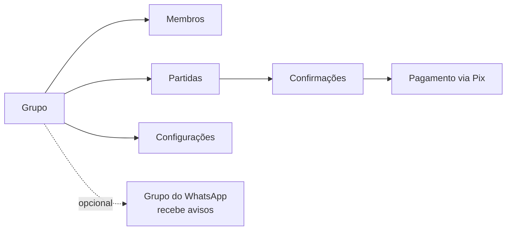
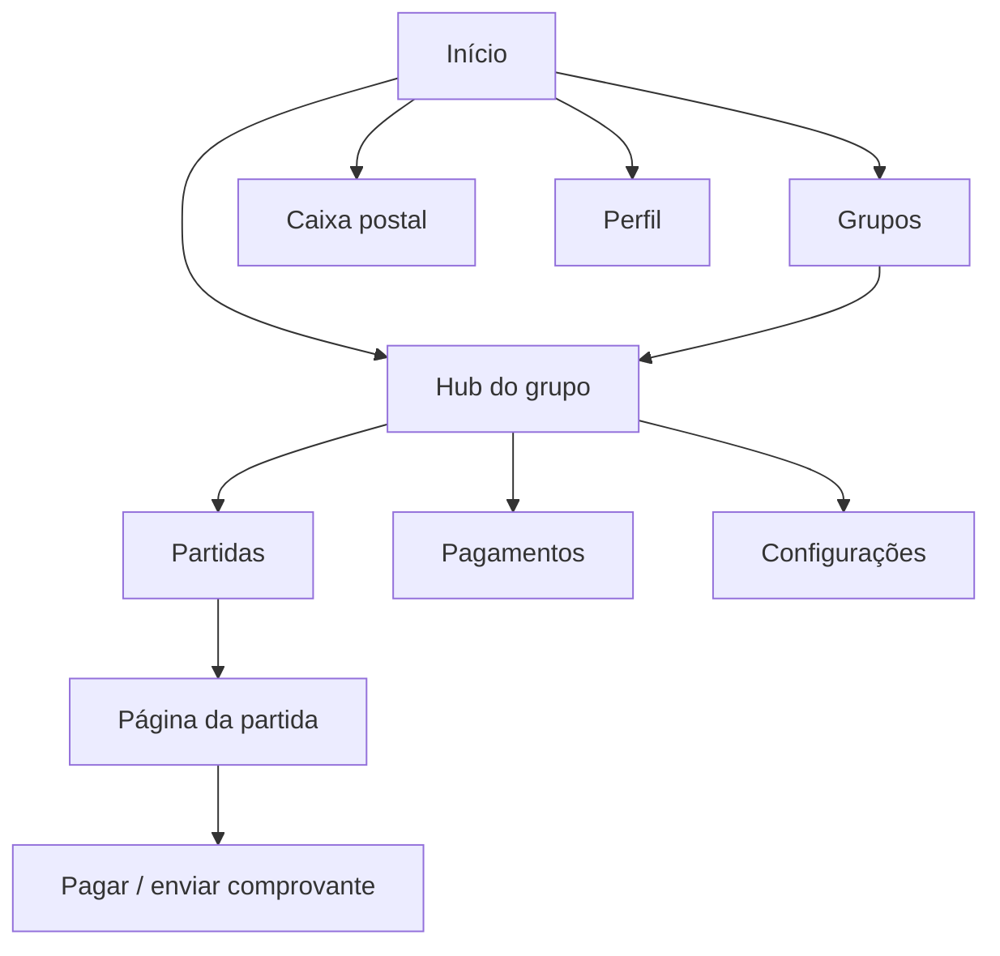
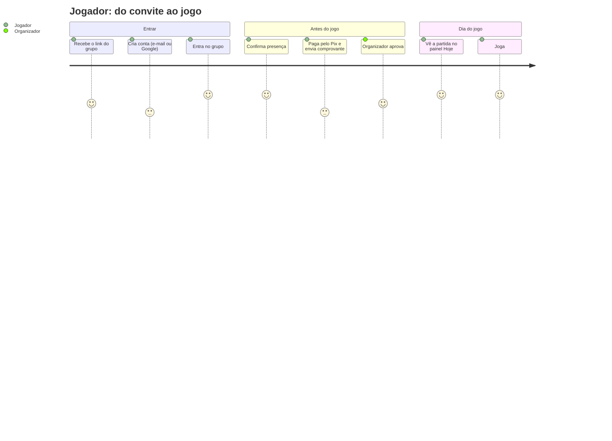
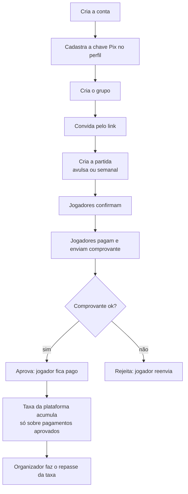
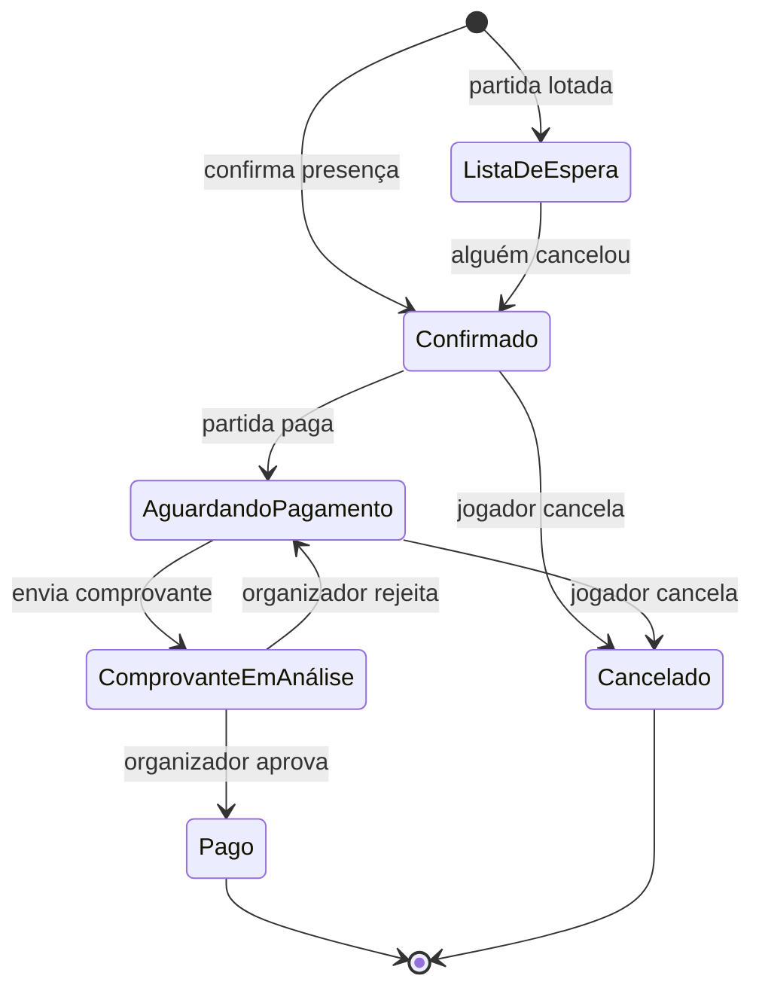

# Guia do usuário: como o Confirmaí funciona

Este guia explica o app para quem **joga** e para quem **organiza**. Os diagramas
(Mermaid) são renderizados direto pelo GitHub. O detalhe técnico de cada fluxo está
em [`docs/uml/`](uml/).

## 1. A ideia em uma frase

Tudo acontece **dentro de um grupo**: o grupo tem membros, as partidas são do grupo e o
pagamento de cada partida vai para o Pix do organizador do grupo.

## 2. Mapa das telas

| Tela | Para quê |
|---|---|
| **Início** (`/`) | O que está acontecendo: painel *Hoje*, seus grupos, pendências, próximas partidas e histórico. |
| **Grupos** (`/grupos`) | Gestão de participação: entrar por convite, criar grupo, sair, pedidos pendentes. |
| **Hub do grupo** (`/grupo/{id}`) | Visão geral do grupo: atalhos, próxima partida, métricas e membros. |
| **Partidas** (`/grupo/{id}/partidas`) | Calendário do grupo: próximas e realizadas, partidas semanais. |
| **Pagamentos** (`/grupo/{id}/pagamentos`) | Jogador vê os próprios pagamentos; organizador vê todos, aprova comprovantes e acompanha o repasse. |
| **Configurações** (`/grupo/{id}/configuracoes`) | Só admin: funcionalidades, membros, recebedor do Pix, grupo do WhatsApp. |
| **Caixa postal** (`/mailbox`) | Mensagens internas e avisos do sistema. |
| **Perfil** (menu do usuário) | Dados pessoais, idioma, chave Pix (obrigatória para organizar partidas pagas). |

## 3. Jornada do jogador

Regras que valem a pena saber:

- **Partida lotada:** quem confirma depois entra na **lista de espera**. Se alguém cancelar,
  o primeiro da fila assume a vaga automaticamente.
- **Cancelar:** cancelar uma confirmação não paga libera a vaga na hora.
- **Sair do grupo:** não é permitido com pagamento pendente. Sem pendência, as suas
  confirmações não pagas de partidas futuras são canceladas.

## 4. Jornada do organizador

- **Pix do grupo:** o QR usa o *recebedor escolhido* nas configurações; se não houver,
  o primeiro admin do grupo que tem Pix. Sem Pix válido, não dá para criar partida paga.
- **Taxa da plataforma:** só conta sobre confirmações **pagas** (aprovadas). Confirmar sem
  pagar não gera dívida para o organizador.
- **Parceria de taxa (opcional, só o admin do sistema):** o grupo pode absorver uma parte
  da taxa da plataforma. O jogador paga só a fatia dele; o repasse do organizador continua
  sobre a taxa cheia. Configurado em `/admin/revenue`.

## 5. Ciclo de uma confirmação

O diagrama técnico completo (com os status reais do banco) está em
[`uml/estados.md`](uml/estados.md).

## 6. WhatsApp (canal secundário)

O app é a fonte da verdade: confirmação, pagamento e comprovante acontecem **no app**.
O WhatsApp só recebe **avisos no grupo** configurado pelo admin (partida cancelada,
mudança de horário, escalação, lembretes). Nunca há mensagem individual, e o aviso de
pendências não mostra nomes nem valores.

## 7. Painel *Hoje* (início)

Ao entrar, o jogador vê:

- saudação e data de hoje;
- **partidas hoje** e a próxima partida;
- **pagamentos pendentes** (leva para a tela de pagamentos do grupo);
- **mensagens não lidas** na caixa postal;
- a **dica do dia**, que muda a cada dia e pode ser navegada.
