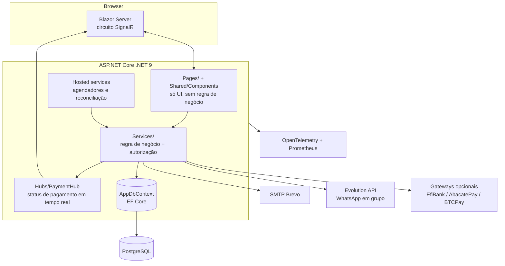
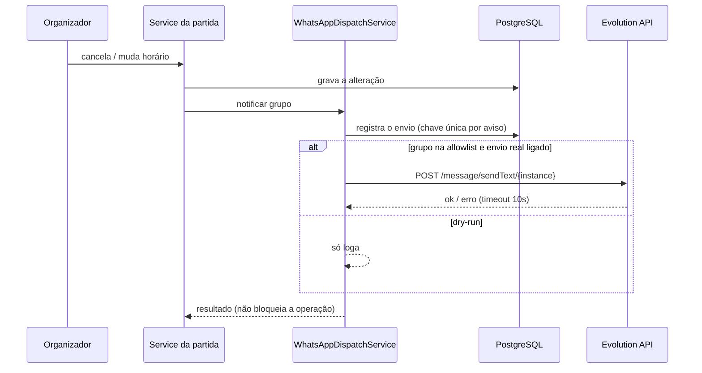

# Arquitetura — visão de componentes

Visão de alto nível para quem chega ao código. Fluxos de negócio detalhados estão em
[`casos-de-uso.md`](casos-de-uso.md), [`estados.md`](estados.md) e
[`sequencia-pagamento-manual.md`](sequencia-pagamento-manual.md).

## Camadas

Regras de organização:

- **Autorização mora no service**, não só na tela (`GroupAccess`, checagem de admin/membro).
- **Dinheiro:** taxa e ledger só consideram `PaymentStatus == Paid`.
- **Pix do grupo:** regra única em `EventPaymentService.GetGroupAdminPixKey`.
- **Textos:** todo texto de UI vem de `UiTextService` (PT/EN/ES em `Services/Core/UiText/`).
- **CSS:** tokens em `wwwroot/css/tokens.css`; padrões em [`../design-system.md`](../design-system.md).

## Workers em segundo plano

| Worker | Função |
|---|---|
| `RachaSchedulerService` | Gera as partidas das agendas semanais. |
| `EventNotificationSchedulerService` | Avisos internos de partidas. |
| `WhatsAppReminderSchedulerService` | Lembretes no grupo do WhatsApp (dry-run por padrão). |
| `EventPaymentReconciliationWorker` | Reconcilia cobranças dos gateways automáticos. |
| `PendingWebhooksAlertService` | Alerta webhooks parados. |
| `PayoutRetryService` | Retenta repasses de gateways. |
| `StaleSettlementMetricsService` | Métrica de repasse parado em análise. |
| `LogRetentionService` | Limpa logs antigos. |
| `CertificateHealthCheckService` | Valida o certificado do EfiBank. |

## Envio de aviso no WhatsApp

