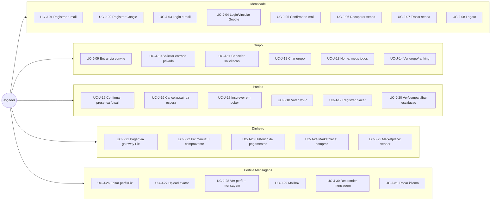
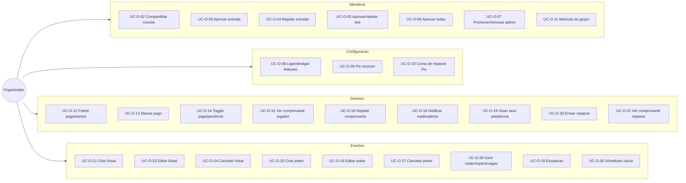
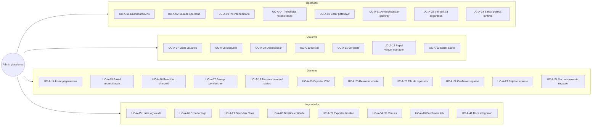

# Mapa de casos de uso por ator (Ciclo 33)

Levantado lendo `Pages/`, `Areas/Identity/`, `Services/` e os `[Authorize]`/`[AllowAnonymous]`
do codigo -- nao de memoria. IDs estaveis: `UC-J-xx` (Jogador), `UC-O-xx` (Organizador),
`UC-A-xx` (Admin da plataforma).

A coluna **Teste** nomeia o teste existente que cobre o UC, ou `FALTA` quando nao ha.
`**` na acao = envolve dinheiro, permissao sobre outros usuarios ou dados de terceiros.
A coluna **Audit** indica se a acao deixa trilha em `Logs` (`AuditAsync`).

## Ator: Jogador

Usuario autenticado comum (role `user`). Nao admin de grupo, nao admin da plataforma.

| UC | Acao | Rota/Tela | Service/metodo | Pre-condicao | Resultado | Audit | Teste |
|---|---|---|---|---|---|---|---|
| UC-J-01 | Registrar com e-mail/senha | `/Identity/Account/Register` | `RegisterModel.OnPostAsync` → `UserManager.CreateAsync` + role `user` + e-mail de confirmacao | E-mail nao cadastrado; senha conforme politica | Conta criada; `RegisterConfirmation` (ou auto-login se confirmacao nao exigida) | nao | FALTA (so GET render: `IdentityPageModelsIntegrationTests`) |
| UC-J-02 | Registrar via Google | `/Identity/Account/ExternalLogin` + `/signin-google` | `ExternalLoginModel.OnGetCallbackAsync` (ramo create) + `ExternalLoginClaimsExtractor` | OAuth configurado; e-mail verificado pelo provider | Conta criada com role `user`, nome/avatar importados, login automatico | sim | `ExternalLoginModelTests.OnGetCallbackAsync_NewEmail_CreatesUserWithEmailConfirmedAndSignsIn` |
| UC-J-03 | Login e-mail/senha | `/Identity/Account/Login` | `LoginModel.OnPostAsync` (`SignInManager` + lockout via `AdminSecurityPolicyService`) | Conta existe; e-mail confirmado se politica exigir | Cookie de sessao; redirect `returnUrl` ou `/` | sim | `AuthenticationIntegrationTests` (lockout, e-mail nao confirmado, politica runtime) |
| UC-J-04 | Login/vincular via Google | `/Identity/Account/ExternalLogin` | `ExternalLoginModel.OnGetCallbackAsync` (`ExternalLoginSignInAsync`, `AddLoginAsync`) | Provider retorna e-mail; verificado p/ vincular | Login ou vinculacao a conta existente | sim | `ExternalLoginModelTests` (4 cenarios: existing login, link, verified, unverified) |
| UC-J-05 | Confirmar e-mail / reenviar | `/Identity/Account/ConfirmEmail`, `/ResendEmailConfirmation` | `ConfirmEmailModel`, `ResendEmailConfirmationModel` | Token valido | `EmailConfirmed=true` | nao | parcial: `IdentityPageModelsIntegrationTests` (link invalido, resend unknown email) |
| UC-J-06 | Recuperar senha | `/Identity/Account/ForgotPassword`, `/ResetPassword` | `ForgotPasswordModel` + `EmailTemplateService`; `ResetPasswordModel` | E-mail informado; token valido | E-mail de reset (resposta identica p/ e-mail inexistente); senha redefinida | nao | `ResetPasswordModelTests` (prefill, nao-revelacao, bad request); POST reset FALTA |
| UC-J-07 | Trocar senha (logado) | `/Identity/Account/ChangePassword` | `ChangePasswordModel.OnPostAsync` (`UserManager.ChangePasswordAsync`, `RefreshSignInAsync`) | Autenticado; senha atual correta | Senha alterada + `UserPasswordChanged` | sim | FALTA (so guard: `ChangePassword_RequiresAuthenticatedUser`) |
| UC-J-08 | Logout | `/Identity/Account/Logout` | `LogoutModel` (`SignInManager.SignOutAsync`) | Autenticado | Sessao encerrada | nao | FALTA (so GET render) |
| UC-J-09 | Entrar em grupo via convite | `/convite/{Code}` | `Join.razor.cs JoinGroup()` (insert `GroupMember`); alt. `GroupDetailService.JoinWithCodeAsync` | Autenticado; `InviteCode` valido; nao-membro | `GroupMemberRole.Member` imediato (sem aprovacao) | nao | `GroupDetailServiceTests.JoinWithCodeAsync_*`; pagina `/convite` FALTA |
| UC-J-10 | Solicitar entrada em grupo privado | `/grupo/{Id}`, `/futsal/{Id}`, `/poker/{Id}` | `GroupDetailService.RequestToJoinAsync`, `EventDetailService.RequestToJoinAsync` | Autenticado; grupo privado; sem request pendente | `GroupJoinRequest` Pending; admin notificado (badge) | nao | `GroupDetailServiceTests.RequestToJoinAsync_*`; `EventDetailServiceTests.RequestToJoinAsync_*` |
| UC-J-11 | Cancelar solicitacao pendente | `/grupo/{Id}`, `/futsal/{Id}` | `GroupDetailService.CancelJoinRequestAsync`, `EventDetailService.CancelJoinRequestAsync` | Request Pending propria | Request removida | nao | `GroupDetailServiceTests.CancelJoinRequestAsync_*`; `EventDetailServiceTests` |
| UC-J-12 | Criar grupo (vira organizador) | `/grupos/criar` | `Create.razor.cs Save()` (EF direto) + audit `GroupCreated` | Autenticado | Grupo + `InviteCode` + `GroupMember(Admin)` | sim | parcial: `GroupInviteCodeGenerationTests` (so geracao de codigo) |
| UC-J-13 | Home: meus jogos e grupos | `/`, `/eventos`, `/jogos` | `Index.razor.cs` (EF direto) | Autenticado | Lista confirmacoes/grupos; empty-state | nao | `HomeGroupFirstIntegrationTests` (anonimo, sem grupo, legacy redirect) |
| UC-J-14 | Ver grupo, partidas, ranking | `/grupo/{Id}`, `/partidas`, `/ranking` | `GroupDetailService.LoadAsync`; EF direto | `/grupo` e `/partidas` publicos; `/ranking` exige membro + feature | Visualizacao | nao | `GroupDetailServiceTests.LoadAsync_*`; `RankingWinCalculationTests`; paginas FALTA |
| UC-J-15 | Confirmar presenca (futsal) | `/futsal/{Id}` | `EventDetailService.ConfirmPresenceAsync` | Autenticado; evento ativo/futuro; membro se privado; vaga | `EventConfirmation` criada ou `WaitingList` se lotado | nao | `EventDetailServiceTests.ConfirmPresenceAsync_*` (4 testes) |
| UC-J-16 | Cancelar confirmacao / sair da espera | `/futsal/{Id}` | `EventDetailService.CancelConfirmationAsync`, `LeaveWaitlistAsync` | Confirmacao propria nao paga / entry propria | Removida; promove waitlist | nao | `EventDetailServiceTests` (`CancelConfirmationAsync_*`, `LeaveWaitlistAsync_*`) |
| UC-J-17 | Inscrever em poker (unlock Home Game, fila, cancelar) | `/poker/{Id}` | `Poker/Detail.razor.cs` `TryUnlock`, `ConfirmPresence`, `CancelConfirmation` (EF direto) | Autenticado; codigo p/ Home Game; membro se privado | `EventConfirmation` criada/removida | nao | FALTA (nenhum teste de `Poker/Detail`) |
| UC-J-18 | Votar MVP pos-partida ** | `/futsal/{Id}/escalacao` | `EscalacaoService.CastVoteAsync` | Membro; evento encerrado; nao vota em si | `PostMatchVote`; MVP revelado com >=50% | nao | `EscalacaoServiceTests.CastVoteAsync_*`; `PostMatchVoteTests` (threshold, calculo) |
| UC-J-19 | Registrar placar pos-partida ** | `/futsal/{Id}/escalacao` | `EscalacaoService.SaveScoreAsync` | Membro; evento encerrado; escalacao confirmada | `ScoreTeamA/B` + `ScoreRegisteredByUserId/At` | nao | `EscalacaoServiceTests.SaveScoreAsync_PersistsScore`; `PostMatchVoteTests.SaveScore_*` |
| UC-J-20 | Ver/compartilhar escalacao | `/futsal/{Id}/escalacao` | `EscalacaoService.LoadAsync`; `EscalacaoTextFormatter` | `LineupConfirmedAt` setado (ou admin) | Escalação exibida; copia/`wa.me` | nao | `FutsalEscalacaoIntegrationTests`; `EscalacaoTextFormatterTests` |
| UC-J-21 | Pagar via gateway Pix (QR/polling) ** | `/pagamento/evento/{ConfirmationId}` | `EventPaymentService.GeneratePixChargeAsync`, `CheckPaymentStatusAsync` (gateways `IEventPaymentGateway`) | Dono da confirmacao; `EnablePaymentGateways`; `Price>0` | BR Code exibido; webhook confirma → `Paid` | sim (webhook/reconciliacao) | `EventPaymentServiceTests`; `EventConfirmationPaymentWebhookFlowIntegrationTests` |
| UC-J-22 | Pix manual + enviar comprovante ** | `/pagamento/evento/{ConfirmationId}` | `EventPaymentService.GetGroupAdminPixKey`, `BuildPixStaticPayload`; `PixProofUploadService.UploadProofAsync` | Gateways off / `ShowDirectPixToOrganizer` | Upload <=5MB jpg/png/webp → `PixProofUploadedAt`; admin confirma manual | nao (gap: upload sem audit) | `PixProofUploadTests` (14 casos); `PixManualPaymentFlowTests` (7 fluxos) |
| UC-J-23 | Historico de pagamentos (filtros, export, cancelar) ** | `/payments`, `/payments/view/{PaymentId}` | `PaymentsHistory.razor.cs`; `PaymentConfirmationService.ConfirmAsync` | Autenticado; dono (seller ve recebidos) | Lista/export CSV-PDF/cancela pendente/re-checa status | nao | `PaymentConfirmationServiceTests`; historico/export/cancel FALTA |
| UC-J-24 | Comprar no marketplace (BTC/Pix) ** | `/marketplace/buy/{ProductId}` (legacy) | `PaymentPageOrchestrator.Generate*/CheckPaymentAsync`; `PaymentCommandService` | Autenticado; produto existe | `PaymentRecord` + QR; webhook confirma → `IsPaid` | sim (webhook) | `PurchaseFlowIntegrationTests` (webhook); lado comprador parcial |
| UC-J-25 | Criar/editar produto (marketplace) ** | `/products/create`, `/products/edit/{Id}` | `ProductService.AddAsync/UpdateAsync` | Autenticado | Produto salvo | nao | `ProductServiceTests` |
| UC-J-26 | Editar perfil (contatos, chave Pix) ** | `/profile/{Id}` proprio | `Profile.razor.cs SaveOwnProfileAsync` → `UserManager.UpdateAsync` | `isOwnProfile` | Contatos + `PixKey` salvos | nao (gap: mudanca de Pix sem audit) | `ProfilePixEditableTests`; `ProfileCharacterizationTests`; `ProfilePixPrivacyTests` |
| UC-J-27 | Upload de avatar | `/profile/{Id}` | `ProfileService.SaveAvatarAsync` | `isOwnProfile`; imagem valida | `AvatarPath` atualizado | nao | FALTA |
| UC-J-28 | Ver perfil de terceiro + mensagem ** | `/profile/{Id}` de outro | `ProfileService.LoadSportStatsAsync`, `SendMessageAsync` | Autenticado; perfil ≠ proprio | Stats publicas; `UserMailboxMessage` entregue | nao | `ProfileServiceTests` (`SendMessageAsync_*`, `LoadChatMessagesAsync_*`) |
| UC-J-29 | Mailbox: listar/ler/arquivar | `/mailbox` | `MailboxQueryService` (Load*, MarkRead, SetArchived); `MailboxConversationArchiveService` | Autenticado | Caixa paginada; marcacoes persistidas | nao | `MailboxQueryServiceTests`; `MailboxConversationArchiveServiceTests` |
| UC-J-30 | Responder mensagem ** | `/mailbox` | `MailboxQueryService.SendQuickReplyAsync` | Conversa com contato nao-SYSTEM | Mensagem na mailbox do destinatario | nao | `MailboxQueryServiceTests.SendQuickReplyAsync_PersistsMessage` |
| UC-J-31 | Trocar idioma | `GET /set-language/{code}` | `LanguagePreferenceService` (cookie) | Nenhuma | Cookie `Confirmai.uiLanguage`; redirect sanitizado | nao | `RecentFeaturesIntegrationTests` (3 cenarios); `FullFlowRecentFeaturesIntegrationTests` |

## Ator: Organizador

`GroupMember` com `Role == GroupMemberRole.Admin` (o criador do grupo vira admin
automaticamente). Inclui tudo do Jogador; abaixo so as acoes exclusivas.

| UC | Acao | Rota/Tela | Service/metodo | Pre-condicao | Resultado | Audit | Teste |
|---|---|---|---|---|---|---|---|
| UC-O-01 | Criar grupo | `/grupos/criar` | EF na page + `GroupCreated` | Autenticado | Grupo + InviteCode + role Admin | sim | parcial (`GroupInviteCodeGenerationTests`) |
| UC-O-02 | Copiar/compartilhar convite | `/grupo/{id}` | `Detail.razor.cs` CopyInviteLink/CopyCode/ShareWhatsApp | Admin do grupo | Link `/convite/{code}` copiado | nao | FALTA |
| UC-O-03 | Aprovar entrada (1 a 1) ** | `/grupo/{id}` | `GroupDetailService.ApproveRequestAsync` | Admin (so UI; service nao valida papel) | `GroupMember` + request Approved + mailbox | nao | `GroupDetailServiceTests.ApproveRequestAsync_*` |
| UC-O-04 | Rejeitar entrada ** | `/grupo/{id}` | `GroupDetailService.RejectRequestAsync` | Admin (so UI) | Request Rejected | nao | `GroupDetailServiceTests.RejectRequestAsync_*` |
| UC-O-05 | Aprovar/rejeitar em lote ** | `/grupo/{id}` | `ApproveSelectedAsync`/`RejectSelectedAsync` | Admin (so UI) | Efeito em massa | nao | `GroupDetailServiceTests.*SelectedAsync_*` |
| UC-O-06 | Aprovar todas pendentes ** | `/grupos` | EF direto na page (`ApproveAllPending`) | Admin (so UI) | Todos viram membros + mailbox | nao | FALTA |
| UC-O-07 | Promover/remover admin ** | `/grupo/{id}/configuracoes` | `GroupFeaturesService.SetMemberRoleAsync` (checa criador no service; impede remover ultimo admin) | Criador do grupo | `GroupMember.Role` alterado | sim | `GroupFeaturesServiceTests.SetMemberRoleAsync_*` (3 testes) |
| UC-O-08 | Ligar/desligar features | `/grupo/{id}/configuracoes` | `GroupFeaturesService.TogglePostMatchRanking/BestPlayerVoting/PaymentGatewaysAsync` | Admin (UI; service nao revalida) | Flags do grupo | sim | `GroupFeaturesServiceTests.Toggle*`; `GroupFeatureRulesTests` |
| UC-O-09 | Definir Pix receiver ** | `/grupo/{id}/configuracoes` | `GroupFeaturesService.SavePixReceiverAsync` | Admin; receptor com PixKey | `Group.PixReceiverUserId` | sim | `GroupFeaturesServiceTests.SavePixReceiverAsync_*` (3) |
| UC-O-10 | Conta Pix de repasse ** | `/grupo/{id}/configuracoes` | `GroupFeaturesService.SavePayoutAccountAsync` | Admin | `GroupPayoutAccount` criada/atualizada | sim | `GroupFeaturesServiceTests.SavePayoutAccountAsync_*` |
| UC-O-11 | Metricas do grupo | `/grupo/{id}` | `GroupMetricsService.GetSnapshot` | Admin | Painel de metricas | nao | `GroupMetricsServiceTests` (5) |
| UC-O-12 | Painel de pagamentos (inadimplencia, comprovantes) ** | `/grupo/{id}/pagamentos` | `GroupPaymentsService.LoadGroupAndCheckAdminAsync` + `LoadPaymentsDataAsync` | Admin verificado no service | Listas delinquency/historico/proofs | nao | `GroupPaymentsServiceTests` (~20 testes) |
| UC-O-13 | Marcar pagamento recebido ** | `/grupo/{id}/pagamentos` | `GroupPaymentsService.MarkPaidAsync` + `StampFeeOnPaidAsync` | Admin (page; service nao revalida) | `Paid` + `MarkedPaidBy` + taxa carimbada | sim | `GroupPaymentsServiceTests.MarkPaidAsync_*` |
| UC-O-14 | Toggle pago/pendente ** | `/futsal/{id}`, `/pagamento/evento/{id}` (admin view) | `AdminConfirmationService.TogglePaidAsync` | Admin do grupo | `PaymentStatus` toggled + fee | sim | `AdminConfirmationServiceTests.TogglePaidAsync_*` (7) |
| UC-O-15 | Ver comprovante do jogador ** | modal em `/grupo/{id}/pagamentos` | `GET /api/pix-proof/{id}` (pagador ou admin do grupo) | Admin do grupo dono do evento | Imagem servida | nao | `PixProofAdminVisibilityTests` |
| UC-O-16 | Rejeitar comprovante ** | `/grupo/{id}/pagamentos` | `GroupPaymentsService.RejectProofAsync` | Admin (page) | Proof limpo; segue nao-pago | sim | FALTA |
| UC-O-17 | Aceitar comprovante → pago ** | `/grupo/{id}/pagamentos` | `GroupPaymentsService.MarkPaidAsync` | Admin + proof pendente | igual UC-O-13 | sim | `GroupPaymentsServiceTests.MarkPaidAsync_*` |
| UC-O-18 | Notificar inadimplente ** | `/grupo/{id}/pagamentos` | `GroupPaymentsService.NotifyDelinquencyAsync` → `EventNotificationService` | Admin | Mensagem interna/e-mail | sim | `DelinquencyNotificationTests` (14) |
| UC-O-19 | Visao da taxa (saldo, repasses) ** | `/grupo/{id}/pagamentos` aba fee | `PlatformFeeSettlementQueryService.GetGroupFeeOverviewAsync` | Admin; futsal sem gateways | Overview accrued/due/settled | nao | `PlatformFeeSettlementQueryServiceTests` (9) |
| UC-O-20 | Enviar repasse com comprovante ** | `/grupo/{id}/pagamentos` | `PlatformFeeSettlementService.SubmitSettlementAsync` (re-verifica admin no service) | Admin; ≥1 partida pendente; valor=residual | `PlatformFeeSettlement` EmAnalise + Items | FALTA audit | `PlatformFeeSettlementServiceTests.SubmitSettlementAsync_*` (12) |
| UC-O-21 | Ver comprovante de repasse | modal | `GET /api/fee-settlement-proof/{id}` → `PlatformFeeSettlementProofAuthorizer` | Submitter/admin grupo/sysadmin | Imagem servida | nao | `PlatformFeeSettlementProofAuthorizerTests` (10) |
| UC-O-22 | Criar partida futsal | `/futsal/create` | `FutsalCreateService.InitializeAsync` (gate admin) + `SaveAsync` | Admin do grupo; Pix se preco>0 | `Event` (+`RachaSchedule` se recorrente) | sim | `FutsalCreateServiceTests` (8) |
| UC-O-23 | Editar partida futsal | `/futsal/{id}/edit` | EF na page + `EventCollisionService` + `NotifyEventUpdatedAsync` | Criador do evento ou sysadmin | Evento atualizado + notificacao | sim | `FutsalIntegrationTests.FutsalEdit_*`; `EventNotificationServiceTests` |
| UC-O-24 | Cancelar partida futsal | `/futsal/{id}/edit` | EF + `NotifyEventCancelledAsync` | Criador ou sysadmin | `IsActive=false` + notificacao | sim | parcial (notificacao); guarda FALTA |
| UC-O-25 | Criar evento poker | `/poker/create` | `PokerCreateService.InitializeAsync` (gate) + `SaveAsync` | Admin do grupo | `Event` poker (+HomeGameCode) | nao | `PokerCreateServiceTests` (10) |
| UC-O-26 | Editar evento poker | `/poker/{id}/edit` | EF + `EventCollisionService` | `CreatedByUserId` | Evento atualizado | nao | FALTA |
| UC-O-27 | Cancelar evento poker | `/poker/{id}` | EF + `NotifyEventCancelledAsync` | `CreatedByUserId` | `IsActive=false` | nao | FALTA |
| UC-O-28 | Gerir roster/espera/vagas ** | `/futsal/{id}` | `EventDetailService.AdminRemove*`/`AdminAdd*SlotAsync` | Admin (page-gated; services nao revalidam) | Roster/vagas ajustados; waitlist promovida | parcial (remocao sim; vagas nao) | `EventDetailServiceTests.Admin*SlotAsync_*`; remocoes FALTA |
| UC-O-29 | Escalacao (confirmar/resetar/nomes) | `/futsal/{id}/escalacao` | `EscalacaoService.ConfirmLineup/ResetLineup/SaveTeamNamesAsync` | `isAdmin` do LoadAsync | `TeamId`, `LineupConfirmedAt`, nomes | nao | `EscalacaoServiceTests.*` |
| UC-O-30 | Gerir schedules do racha | `/futsal/schedule`, `/edit` | EF na page; `RachaSchedulerService` (background) | Lista filtrada por `CreatedByUserId`; toggle sem re-checagem | `RachaSchedule` atualizado/IsActive | nao | `RachaSchedulerServiceTests` (geracao); toggle/edit FALTA |

## Ator: Admin da plataforma

Role `admin`. Todas as rotas `/admin/*` declaram `[Authorize(Roles = "admin")]`
(convencao garantida por `AdminAuthorizationConventionsTests`).

| UC | Acao | Rota/Tela | Service/metodo | Pre-condicao | Resultado | Audit | Teste |
|---|---|---|---|---|---|---|---|
| UC-A-01 | Dashboard + saude de reconciliacao | `/admin` | `DashboardMetricsService`, `ReconciliationHealthService` | role admin | KPIs renderizados | nao | `DashboardMetricsServiceTests`; `ReconciliationHealthServiceTests`; `ProtectedPagesIntegrationTests` |
| UC-A-02 | Salvar taxa de operacao (%) ** | `/admin` | `AdminSettingsService.SetOperationFeePercentForAdminAsync` | admin | AppSetting atualizado | sim | `AdminSettingsServiceTests`; `AuditLoggingHooksTests` |
| UC-A-03 | Pix intermediario do site ** | `/admin` | `AdminSettingsService.SetSiteIntermediaryPixKeyForAdminAsync` | admin; <=160 chars | AppSetting salvo/removido | sim | `AuditLoggingHooksTests` (audit); validacao FALTA |
| UC-A-04 | Thresholds de reconciliacao | `/admin` | `SetReconciliationSeverityThresholdsForAdminAsync` | admin; critical >= warning | Thresholds persistidos | sim | FALTA |
| UC-A-05/06 | Idioma / moeda (preferencias) | `/admin` | `LanguagePreferenceService`, `CurrencyPreferenceService` | admin | Preferencia pessoal | nao | `LanguagePreferenceServiceTests`; `CurrencyPreferenceServiceTests` |
| UC-A-07 | Listar/filtrar usuarios ** | `/admin/users` | `AdminUsersQueryService`; `AdminUsersFilterStateService` | admin | Pagina + papeis | nao | `AdminUsersQueryServiceTests`; `AdminUsersFilterStateServiceTests` |
| UC-A-08 | Bloquear usuario ** | `/admin/users` | `UserManager.SetLockoutEndDateAsync(Max)` + `LogAsync` | admin | Lockout permanente | log (Warning) | FALTA |
| UC-A-09 | Desbloquear usuario ** | `/admin/users` | `SetLockoutEndDateAsync(null)` | admin | Lockout removido | log | FALTA |
| UC-A-10 | Excluir usuario ** | `/admin/users` | `UserManager.DeleteAsync` + `AuditAsync(UserDeleted)` | admin | Usuario removido | sim | FALTA |
| UC-A-11 | Ver perfil completo ** | `/admin/users/view/{UserId}` | `UserManager.FindByIdAsync`, `IsInRoleAsync` | admin | Perfil renderizado | nao | FALTA (rota coberta) |
| UC-A-12 | Papel venue_manager ** | `/admin/users/view/{UserId}` | `AddToRoleAsync`/`RemoveFromRoleAsync` | admin | Papel alternado | nao | FALTA |
| UC-A-13 | Editar dados sociais/Pix do usuario ** | `/admin/users/edit/{UserId}` | `UserManager.UpdateAsync` + `LogAsync` | admin | Usuario atualizado | log | `EditUserModelTests` (modelo); acao FALTA |
| UC-A-14 | Listar pagamentos ** | `/admin/payments` | `AdminPaymentsQueryService` | admin | Tabela + deep-link `/payments/view` | nao | `AdminPaymentsQueryServiceTests`; `AdminPaymentsDeepLinkIntegrationTests` |
| UC-A-15 | Painel de reconciliacao ** | `/admin/payments` | `AdminPaymentsSummaryService`, `SummaryAgeTracker`, `ReconciliationSeverityEvaluator` | admin | Resumo + severidade | nao | `AdminPaymentsSummaryServiceTests`; `ReconciliationSeverityEvaluatorTests` |
| UC-A-16 | Revalidar chargeId ** | `/admin/payments` | `AdminPaymentsCommandService.ReconcileChargeAsync` | admin | Pago se gateway confirmar | sim | `AdminPaymentsCommandServiceTests`; `EventPaymentReconciliationServiceTests` |
| UC-A-17 | Sweep de pendencias ** | `/admin/payments` | `AdminPaymentsCommandService.RunSweepAsync` | admin | Ate 50 reconciliadas | sim | `AdminPaymentsCommandServiceTests`; `EventPaymentReconciliationServiceTests` |
| UC-A-18 | Transicao manual de status ** | `/admin/payments` | `AdminPaymentsCommandService.ApplyStatusTransitionAsync` | admin; motivo | Status alterado | sim | `AdminPaymentsCommandServiceTests`; `EventConfirmationPaymentStatusServiceTests` |
| UC-A-19 | Exportar CSV reconciliacao | `/admin/payments` | `AdminPaymentsQueryService.BuildReconciliationExportAsync` | admin | Download CSV | nao | `AdminPaymentsQueryServiceTests`; `AdminLogsExportServiceTests` |
| UC-A-20 | Relatorio de receita ** | `/admin/revenue` | `AdminRevenueReportService` | admin | Totais + por grupo | nao | `AdminRevenueReportServiceTests` |
| UC-A-21 | Fila de repasses ** | `/admin/revenue` | `PlatformFeeSettlementQueryService.GetReviewQueueAsync` | admin | Fila EmAnalise + devedores | nao | `PlatformFeeSettlementQueryServiceTests.GetReviewQueueAsync_*` |
| UC-A-22 | Confirmar repasse ** | `/admin/revenue` | `PlatformFeeSettlementService.ReviewSettlementAsync(approve)` | sysadmin; EmAnalise | `Pago` + ReviewedBy/At | FALTA audit | `PlatformFeeSettlementServiceTests.ReviewSettlementAsync_*` |
| UC-A-23 | Rejeitar repasse ** | `/admin/revenue` | `ReviewSettlementAsync(reject, note)` | sysadmin; motivo | `Rejeitado` + motivo | FALTA audit | `PlatformFeeSettlementServiceTests.ReviewSettlementAsync_Reject_*` |
| UC-A-24 | Ver comprovante de repasse ** | `/admin/revenue` | `GET /api/fee-settlement-proof/{id}` | admin | Imagem | nao | `PlatformFeeSettlementProofAuthorizerTests` |
| UC-A-25 | Listar logs/audit ** | `/admin/logs` | `AdminLogsQueryService`, `AdminLogsFilterOrchestrator` | admin | Tabela + badges | nao | `AdminLogsQueryServiceTests` + familia de testes de filtro/ordenacao |
| UC-A-26 | Exportar logs CSV/JSON ** | `/admin/logs` | `AdminLogsExportCommandService`, `AdminLogsExportService` | admin | Download <=10k linhas | nao | `AdminLogsExportCommandServiceTests`; `AdminLogsExportServiceTests` |
| UC-A-27 | Deep-link de filtros | `/admin/logs?...` | `AdminLogsQueryOverridesParser`, `AdminLogsDeepLinkBuilder` | admin | Filtros da URL | nao | `AdminLogsQueryOverridesParserTests`; `AdminLogsDeepLinkBuilderTests` |
| UC-A-28 | Timeline de auditoria ** | `/admin/audit/{EntityType}/{EntityId}` | `AdminLogsQueryService.GetEntityTimelineAsync` | admin | Timeline | nao | `AdminLogsQueryServiceTests`; `AuditLoggingHooksTests` |
| UC-A-29 | Exportar timeline | `/admin/audit/...` | `AdminLogsExportService.BuildTimeline*` | admin | Download | nao | FALTA |
| UC-A-30 | Listar gateways | `/admin/gateways` | `GatewayService.GetAllAsync`, `EventPaymentGatewayFactory` | admin | Lista + status | nao | `GatewayServiceTests`; `EventPaymentGatewayFactoryTests` |
| UC-A-31 | Ativar/desativar gateway ** | `/admin/gateways` | `GatewayService.SetStatusAsync` | admin | Toggle + log | log | `GatewayServiceTests.SetStatusAsync_*` |
| UC-A-32 | Ver politica de seguranca | `/admin/security` | `SecurityPolicyDefaults`, `AdminSecurityPolicyService.Get*` | admin | Baseline + runtime | nao | `AdminSecurityPolicyServiceTests` |
| UC-A-33 | Salvar politica runtime ** | `/admin/security` | `AdminSecurityPolicyService.SetRuntimePolicyForAdminAsync` | admin; ranges validos | `Security.*` persistidos | log (nao AuditAsync) | `AdminSecurityPolicyServiceTests.SetRuntimePolicyForAdminAsync_*` |
| UC-A-34 | Listar venues | `/admin/venues` | EF direto | admin | Lista | nao | FALTA |
| UC-A-35 | Ativar/desativar venue | `/admin/venues` | EF + `AuditAsync(venue.activated/deactivated)` | admin | `IsActive` toggled | sim | FALTA |
| UC-A-36 | Excluir venue | `/admin/venues` | EF + `AuditAsync(venue.deleted)` | admin; sem eventos | Removida | sim | FALTA |
| UC-A-37 | Criar/editar venue | `/admin/venues/edit/{Id}` | EF + `AuditAsync(venue.created/updated)` | admin | Salva | sim | FALTA |
| UC-A-38 | Atribuir admin de venue ** | `/admin/venues/edit/{Id}` | `UserManager` + `AuditAsync(venue.admin_assigned)` | admin | `VenueAdminUserId` + papel | sim | FALTA |
| UC-A-39 | Remover admin de venue ** | `/admin/venues/edit/{Id}` | `UserManager` + `AuditAsync(venue.admin_removed)` | admin | Vinculo removido | sim | FALTA |
| UC-A-40 | Parchment lab | `/admin/parchment-lab` | estatico | admin | Pagina | nao | FALTA (so convencao de Authorize) |
| UC-A-41 | Docs de integracao | `/docs/integration` | estatico | claim `server_admin` | Pagina + .lua | nao | FALTA |

## Endpoints HTTP nao-Blazor

| Metodo | Rota | Auth | O que faz | Teste |
|---|---|---|---|---|
| POST | `/api/btcpay/webhook` | `X-BTCPay-Secret` (FixedTimeEquals) + rate limit ** | `PaymentRecord` pago em `InvoiceSettled`; anti-replay; audit `PaymentConfirmed` | `WebhookEndpointIntegrationTests` (20+); `BtcPayWebhookServiceTests` |
| POST | `/api/abacatepay/webhook` | `webhookSecret` + HMAC-SHA256 + rate limit ** | Confirma `EventConfirmation`/pagamento via `WebhookPaymentMarker` | `AbacatePayWebhookServiceTests`; `WebhookSecretValidatorTests`; `WebhookPaymentMarkerTests` |
| POST | `/api/webhooks/efibank/pix` | mTLS opcional + `webhookSecret` + rate limit ** | Confirma por `txid` do array `pix` | `EfiBankWebhookServiceTests` (14) |
| GET | `/api/pix-proof/{id}` | RequireAuthorization; pagador ou admin do grupo ** | Serve imagem do comprovante | FALTA (handler inline; upload coberto por `PixProofUploadTests`) |
| GET | `/api/fee-settlement-proof/{id}` | RequireAuthorization; submitter/admin grupo/sysadmin ** | Serve comprovante de repasse | `PlatformFeeSettlementProofAuthorizerTests` (autorizador; handler FALTA) |
| POST | `/api/test/seed-event-confirmations` | NENHUMA — so Development/Testing | Seed de confirmacoes | `NoUnauthenticatedSeedEndpointsTests` (convencao) |
| GET | `/api/ping` | `[Authorize]` | Liveness autenticado | `PingControllerTests` |
| GET | `/health` | Anonimo | Health check + DbContext check | FALTA |
| GET | `/set-language/{code}` | Anonimo | Cookie de idioma; redirect sanitizado | `RecentFeaturesIntegrationTests` |
| WS | `/paymentHub` | `[Authorize]` | Push `PaymentConfirmed` | `PaymentHubTests` |
| GET+POST | `/Identity/Account/*` | Anonimo/Autenticado + rate limit `auth` | Identity Razor Pages | `IdentityPageModelsIntegrationTests`; `AuthenticationIntegrationTests`; `ExternalLoginIntegrationTests` |
| GET | `/signin-google` | OAuth middleware | Callback Google | `ExternalLoginIntegrationTests` |
| GET | `/error` | Anonimo | `UseExceptionHandler` target | `ErrorPageIntegrationTests` |
| GET | `/downloads/*.lua` estaticos | Anonimo | `Content-Disposition: attachment` | FALTA |

## Backlog FALTA consolidado

### Critico (dinheiro, permissao ou dado de outro usuario) — alvo da Fase 3

| UC | Por que critico |
|---|---|
| UC-O-16 Rejeitar comprovante | Acao auditada mas sem teste; limpa prova de pagamento |
| UC-O-06 Aprovar todas pendentes | Efeito em massa sobre membros, sem service/audit |
| UC-J-09 Entrar via `/convite` (page) | Join imediato sem aprovacao; so o caminho alternativo tem teste |
| UC-J-17 Poker inscrever/cancelar | `Poker/Detail.razor.cs` inteiro sem cobertura |
| UC-J-23 Historico/cancelar pagamento | Cancelamento de `PaymentRecord` pendente sem teste |
| UC-J-22 audit gap | Upload de comprovante sem `AuditAsync` (Fase 2 do C34 adiciona; teste aqui valida) |
| UC-O-20/UC-A-22/23 audit gap | Settlement submit/review sem `AuditAsync` (teste aqui falhara ate o C34 adicionar — documentado) |
| UC-A-08/09/10 Bloquear/desbloquear/excluir usuario | Permissao destrutiva sem teste |
| UC-A-12 Papel venue_manager | Grant/revoke de papel sem teste nem audit |
| `/api/pix-proof/{id}` handler | Endpoint que vaza imagem se autorizacao falhar — sem teste do handler em si |
| UC-J-01 Register POST / UC-J-07 ChangePassword POST / UC-J-08 Logout POST | Fluxos de identidade sem teste de acao |

### Nao-critico (backlog listado, sem teste imediato)

UC-O-02 (copiar convite), UC-J-27 (avatar), UC-J-14 paginas partidas/ranking,
UC-O-24 guarda de cancelamento, UC-O-26/27/28-remocoes/30 (poker edit/cancel,
remocao de roster, schedule toggle), UC-A-04, UC-A-11, UC-A-13-acao, UC-A-29,
UC-A-34..39 (venues), UC-A-40/41, `/health`, estaticos `.lua`, marketplace
UC-J-24/25 lado pagina (rotas legacy orfas — `/marketplace` e `/products`
redirectam para `/servers`, que nao existe).
