# Diagramas de estado (Ciclo 33)

Os 2 objetos que carregam dinheiro: `EventConfirmation.PaymentStatus` (pagamento do
jogador) e `PlatformFeeSettlement.Status` (repasse do organizador ao admin).
O ciclo de vida da confirmacao/lista de espera tambem esta aqui por estar acoplado
ao pagamento (confirmacao nao-paga pode ser cancelada; paga nao pode).

## 1. EventConfirmation — ciclo de vida (vaga + pagamento)

`EventConfirmation` e `WaitingList` sao entidades separadas: a "lista de espera" e
uma linha em `WaitingList`, nao um status da confirmacao. Promover = apagar a linha
da fila e criar a `EventConfirmation`.

```mermaid
stateDiagram-v2
    [*] --> Confirmado: ConfirmPresenceAsync (vaga livre)
    [*] --> EmEspera: ConfirmPresenceAsync (lotado) → linha WaitingList
    EmEspera --> Confirmado: PromoteFromWaitlistAsync (vaga abriu; posicao = menor Position)
    EmEspera --> [*]: LeaveWaitlistAsync (jogador sai) / AdminRemoveFromWaitlistAsync
    Confirmado --> [*]: CancelConfirmationAsync (jogador; so se nao pago) / AdminRemoveConfirmationAsync

    state Confirmado {
        [*] --> Pending: EventConfirmation criada (default)
        Pending --> Paid: MarkPaidAsync (org. manual) / webhook gateway / TogglePaidAsync / reconciliacao
        Pending --> Failed: transicao admin / gateway falhou
        Pending --> Expired: janela da cobranca Pix expirou (sem polling novo)
        Failed --> Pending: transicao admin (re-tentativa)
        Failed --> Paid: transicao admin
        Paid --> Refunded: transicao admin
        Refunded --> [*]: terminal
        Expired --> [*]: terminal
    }
```

**Regras de transicao (fonte: `EventConfirmationPaymentStatusService.IsAllowedTransition`):**

| De | Para | Quem dispara |
|---|---|---|
| Pending | Paid | `GroupPaymentsService.MarkPaidAsync` (organizador), `AdminConfirmationService.TogglePaidAsync`, webhook (`WebhookPaymentMarker`), reconciliacao |
| Pending | Failed | `TransitionStatusAsync` (admin, com motivo) |
| Pending | Expired | marcacao pela expiracao da janela Pix (reconciliacao para de pollar) |
| Failed | Pending | `TransitionStatusAsync` (admin) |
| Failed | Paid | `TransitionStatusAsync` (admin) |
| Paid | Refunded | `TransitionStatusAsync` (admin) |
| Refunded | — | terminal |
| Expired | — | terminal |

**Efeitos colaterais do Pending → Paid:**
- `HasPaid = true` (flag legada mantida em sync pelo service).
- `MarkedPaidByUserId`/`MarkedPaidAt` preenchidos quando via manual/admin (null via gateway).
- `PlatformFeeLedgerService.StampFeeOnPaidAsync` grava o snapshot `PlatformFeeAmount`
  (V1: futsal manual = taxa fixa configurada; gateway/V2 = percentual).
- Audit: `EventConfirmationPaidManual` (manual) / `PaymentConfirmed` (gateway/admin).

**Side effects de Paid → Refunded:** audit `PaymentRefunded` (nao estorna a taxa
automaticamente — ajuste manual do admin).

## 2. PlatformFeeSettlement — repasse do organizador

Espelha o fluxo do comprovante do jogador, um nivel acima:
organizador paga a taxa acumulada → envia comprovante → admin do sistema revisa.

```mermaid
stateDiagram-v2
    [*] --> EmAnalise: SubmitSettlementAsync (admin do grupo; valor = taxa residual; comprovante obrigatorio)
    EmAnalise --> Pago: ReviewSettlementAsync(approve) (sysadmin)
    EmAnalise --> Rejeitado: ReviewSettlementAsync(reject, motivo obrigatorio)
    Pago --> [*]: terminal — Items quitam as partidas cobertas
    Rejeitado --> [*]: terminal — organizador re-envia novo settlement
```

**Regras (fonte: `PlatformFeeSettlementService`):**

- `EmAnalise` e o estado inicial (nao existe rascunho persistido — a selecao de
  partidas acontece na tela antes do submit).
- `SubmitSettlementAsync` re-verifica `Role == Admin` no service; valida mime/tamanho
  do comprovante, selecao nao-vazia e valor == taxa residual das partidas escolhidas.
- `ReviewSettlementAsync`: so sysadmin; organizador nao revisa o proprio repasse;
  rejeicao exige `note` nao vazio; settlement ja revisado retorna erro.
- Ao `Pago`: `PlatformFeeSettlementItem`s marcam as partidas cobertas como quitadas
  no overview do grupo.
- **Gap conhecido (C34 Fase 2):** `SubmitSettlementAsync` e `ReviewSettlementAsync`
  **nao** chamam `AuditAsync` — o caminho do repasse nao gera trilha hoje.
